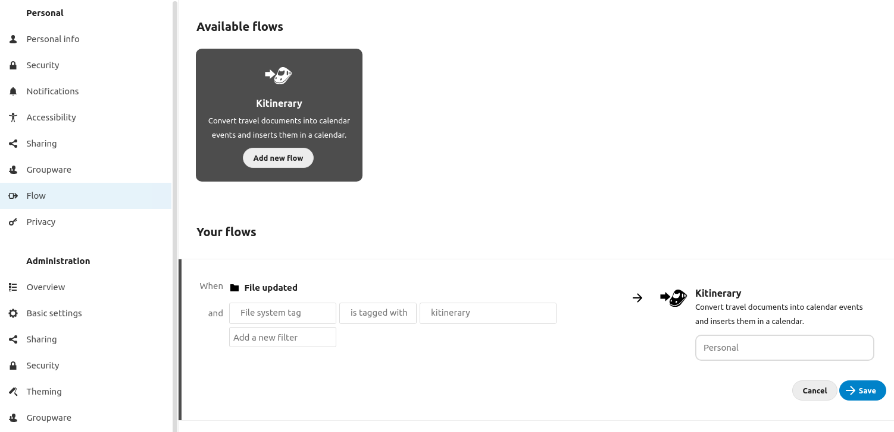

# Nextcloud Kitinerary workflow

This app lets Nextcloud automatically convert travel documents to calendar events using KDE itinerary project. By utilizing the workflow engine it allows Nextcloud users to define rules upon which various documents are converted to calendar events. The conversion happens by feeding the source file to the kitinerary-extractor binary.

Learn more about workflows on https://nextcloud.com/workflow

## Advices on configuration

Nextcloud flow will not let you select a folder in which to apply the flow, but you can use a tag constraint and it will be checked on parent folders as well.
So the recommended configuration is to select "file updated" and a system tag `travel` for instance.
Then you create a folder tagged `travel`, and you put in this folder the files you want to be analyzed by kitinerary to search for travel documents (may be train tickets, plane tickets, hotel reservations and so on).

## Kitinerary binary

The application ships a statically link binary. If this does not work on your setup, or if you want to use a newer version of kitinerary for better results, you can install kitinerary and make sure kitinerary-extractor binary is in the `$PATH` (most distributions package it in `/usr/lib`, you’ll have to symlink in `/usr/local/bin` or wherever in your path).
